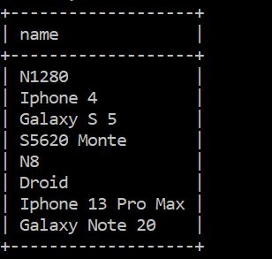
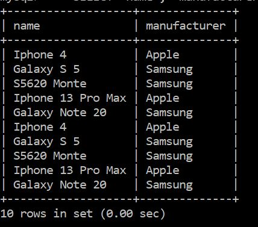
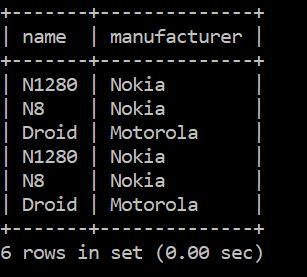
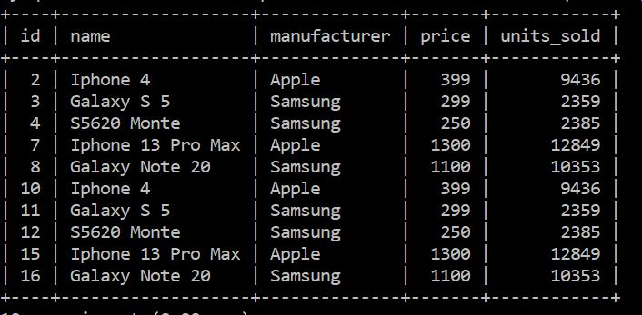
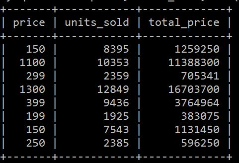

# Database Sales 
1. Créer une base de données appelée sales

## LDD Langage de Définition de Données
### Créer une table appelée telephones avec les colonnes suivantes :
   1. **name** : chaîne de caractères qui représente le modèle du téléphone
   2. **manufacturer** : chaîne de caractères qui représente le fabricant
   3. **price** :  un nombre qui représente le prix UHT
   4. **units_sold** : nombre qui représentent la quantité vendue

## LMD Langage de Manipulation de Données 1 : Insertions
1. Insérer les données suivantes : 
-----------------------------------
| ID | name | manufacturer | price | units_sold |
| :---- | :---- | :----------- | :---- | :--------- |
| 1 | N1280 | Nokia | 199 |1925|
| 2 | Iphone 4 | Apple | 399 | 9436 |
| 3 | Galaxy S 5 | Samsung | 299 | 2359 |
| 4 | S5620 Monte | Samsung | 250 | 2385 |
| 5 | N8 | Nokia | 150 | 7543 |
| 6 | Droid | Motorola | 150 | 8395 |
| 7 | Iphone 13 Pro Max | Apple | 1300 | 12849 |
| 8 | Galaxy Note 20 | Samsung | 1100 | 10353 |

## LMD 2 : Selection(projection)
   1. Ecrire une requête pour liste tous les modèles de téléphones
   
=====================================================================================
   2. Ecrire une requête pour lister tous les telephones(name, manufacturer) de tous les téléphones dont le prix est supérieur à 200€
   
=====================================================================================
   3. Ecrire une requête pour lister tous les telephones(name, manufacturer) de tous les téléphones dont le prix est varie entre 150 et 200€

      

   4. Lister tous les téléphones de marque samsung et Apple
      
===
   5. Afficher le revenu total pour les téléphones vendues.Pour chaque téléphone, vous avez le prix et la quantité vendu
      
