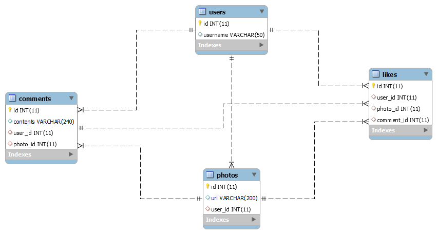

# INSTAGRAM

Ecrire les requêtes SQL ci-dessous SQL sur la BDD instagram.

## Modélisation de ma bdd

### 1. Pour tous les commentaires, afficher son contenu et l’url de la photo à laquel le commentaire a été ajouté

### 2. Pour chaque commentaire, afficher son contenu et l'url de la photo à laquel le commentaire a été ajouté

### 3. Afficher l'url de chaque photo et le nom d'utilisateur de l'auteur

### 4. Trouver tous les commentaires pour la photo d'id 3, avec le username de l'utilisateur qui a commenté

### 5. Trouver tous les url des photos ainsi que tous les commentaires qui ont été posté par l'auteur de la photo

### 6. Le nombre de likes pour la photo d’ID 4